# 511801 eApp — Validated End-to-End Flow (screens → backend → memApp fields)

> **INTERNAL — never ingest into Jacob's knowledge base.** This document names
> underwriting vendors, rule-engine stages, and internal codes. It exists so the
> appstate projection (and its maintainers) read the memApp correctly. Everything
> here was validated 2026-08-23 by the SME (Daniel) in a field-by-field Q&A, plus
> the backend log reconstruction of demo application ARCK26233T697 (filenames
> only — no log bodies/PII were pulled).
>
> Sources per fact: **[SME]** = confirmed answer · **[logs]** = observed in the
> ARCK26233T697 trace · **[both]** where they agree.

---

## 1. The timeline fields

| Field | Meaning | Set when |
|---|---|---|
| `arcDate` | Application (arcId) created | `initAppSession` — before any quote input **[SME/logs]** |
| `appInitDate` | **Interview** start | Agent acknowledges after quote/verification and starts the interview (`initApp`) **[both]** |
| `npwTimeOutTimestamp` | Scheduled pre-decision deadline = `appInitDate` + 30 days; **cleared when a decision lands** | At interview start **[SME]** |
| `npwOfferExpiredTimestamp` | Scheduled payment-window deadline = offer approval + 30 days | When the offer is approved **[SME]** |
| `appExpiryDate` | The *current* deadline in date form; **likely refreshed to +30 at offer approval** (SME: "as far as I know, refreshed" — not certain) | Interview start, then refresh **[SME, tentative]** |

Deadlines are **scheduled**, never fired-events: only a timestamp already in the
past means the window actually lapsed. Presence means nothing.

`stuck*Timestamp` fields (`stuckUWConsentTimestamp`, `stuckSignatureTimestamp`,
…) are **reminder-job markers, not live state** — they are ignored entirely by
the projection. **[SME]**

---

## 2. The happy path

```mermaid
flowchart TD
    A["QO100 lead form<br/><i>leadForm</i>"] --> A2["MS100 pre-application assessment"]
    A2 --> B["QO105 quote — coverage ⇄ premium<br/><i>getQuote/calculatePremium + calculateMaxValues</i>"]
    B --> B2["QO110 confirm eligibility<br/>(3 criteria + condition checklist, agent confirms ALL)"]
    B2 -->|Next| C["Agent verification<br/><i>splitAgentVerify / cgAgentConfirmation</i>"]
    C --> C2["QO115 'Before You Begin' producer Qs · QO120 security warning"]
    C2 --> D["Start application → START INTERVIEW<br/><b>appInitDate set · npwTimeOutTimestamp = +30d</b><br/><i>initApp · arcMatch · GETPARTYINQUIRY · customer_eligibility</i>"]
    D --> E["IV100–IV115 dynamic interview<br/><i>getAppQA ⇄ RuleEngine attribute, per answer</i>"]
    E --> F["IV120 review → Next<br/><i>confirmUWQA · consent-bundle PDFs · RuleEngine KO</i>"]
    F -->|KO| KO["Knock-out decline<br/>appDecisionCode 4-class"]
    F -->|clean| G["CO100 consent — email/SMS link, client views PDF,<br/>gets OTP, shares it, agent enters → Next<br/><b>uwConsentFlag=1 + uwConsentTimeStamp</b><br/><i>notifyApplicantConsent · verifyCustomerConsent · submitAuth</i>"]
    G --> H["BE100 beneficiaries<br/><i>submitBenePrimaryContingent</i>"]
    H --> I["DW100 decision wait<br/><i>getDecision polling · IDCHECKDATA · MIB/SHERLOCK · MMDATA ·<br/>RuleEngine: MM→KOMM→MIB→LABPIQ→FLATEXTRA→KOMVR→<b>FINAL</b></i><br/><b>appDecisionCode (+ npwTimeOutTimestamp cleared)</b>"]
    I -->|approved| J["OF100 offer<br/><i>calculatePremium-offer · ageUP re-check · SUBMITORDER/ATTACHDOCUMENT (agenium)</i><br/><b>offerAcceptanceFlag on accept · npwOfferExpiredTimestamp = +30d</b>"]
    J --> K["PM100 payment<br/><i>validateBankDetails (GIACT) · submitPayInfo</i>"]
    K --> L["SA100 secondary addressee<br/><i>thirdPartyDesignee</i>"]
    L --> M["SC100 split commissions<br/><i>splitCommission · sign-packet PDFs assembled + insuredappsign URL</i>"]
    M --> N["SN100 signature — email/SMS link, OTP shared,<br/>agent enters → Next<br/><b>eSignFlag=1 + eSignTimestamp</b><br/><i>notifyApplicantSign/ReviewAndSign · verifyCustomerConsent · appSign</i>"]
    N --> O["AC100 producer certification<br/><b>agentCertFlag=1 + agentCertTimestamp</b><br/><i>agentCertification · ageUP re-check</i>"]
    O --> P["CG100 congratulations —<br/>behind the scenes policy submitted to CG as <b>A103</b><br/><b>finalAdminIntegrationFlag=1 + finalAdminIntegrationTimestamp</b><br/><i>GETFINAL (3MB, thirdParty-utility-cg)</i>"]
    P --> Q["'Pending Issue' …then <b>policyPacketPdf</b> arrives =<br/>the REAL Issued (+ policyNo)"]
```

Step-by-step with everything on it:

| # | Screen / step | Who acts | Backend (internal) | memApp fields set | Validated |
|---|---|---|---|---|---|
| 0 | Session starts | agent | `initAppSession`, arcTriggers | **`arcDate`** | [both] |
| 1 | QO100 lead form → **MS100 pre-application assessment** | agent | `leadForm`; `stream` (page engine), `Owner Journey` | quote inputs | [SME — assessment comes BEFORE the quote screen] |
| 2 | QO105 quote (coverage ⇄ premium) → QO110 confirm eligibility (3 criteria + condition checklist, full text now in the KB's screens guide) | agent | `getQuote` → `calculatePremium-quote`, `calculateMaxValues` (the age/class maxima) | — | [both] |
| 3 | QO110 **Next** → agent verification → QO115 "Before You Begin" producer Qs → QO120 security warning | system/agent | `splitAgentVerify` / `equitableWinterfell` / `cgAgentConfirmation` (agent-verify-utility) | — | [both] |
| 4 | Acknowledge → **interview starts** | agent | `initApp` + `arcMatch` (existing-app match → resume routing) + `GETPARTYINQUIRY` (CG party lookup) + `customer_eligibility` | **`appInitDate`**, **`npwTimeOutTimestamp` = +30d** | [both] |
| 5 | IV100–IV115 interview (dynamic, page at a time) | agent+client | `getAppQA` ⇄ `arcRe RuleEngine attribute` per answer — answers save as entered | interview answers | [both] |
| 6 | IV120 review → Next | agent | `confirmUWQA`; consent bundle assembled (fcra/privacy/hipaa/econsent PDFs → merged); **`RuleEngine KO`** | — | [both] — **KO decline exits here** [SME] |
| 7 | CO100 consent | client (link) + agent (OTP) | `notifyApplicantConsent` → consent email/SMS; client views PDF, gets OTP, shares it; agent enters → `verifyCustomerConsent`; then `submitAuth` kicks post-consent pulls (`IDCHECKDATA`, `MIBSHERLOCKDATA`, cip PDFs) | **`uwConsentFlag=1` + `uwConsentTimeStamp`**, `consentEmailSent`/`smsConsentFlag` | [both] |
| 8 | BE100 beneficiaries → Next | agent | `submitBenePrimaryContingent` | bene records | [both] |
| 9 | DW100 decision | system | `getDecision` polling; `MMDATA` (Milliman), `MIBBLOBDATA`, `LABPIQDATA`; RuleEngine stages MM → KOMM → MIB → LABPIQ → FLATEXTRA → KOMVR → **FINAL**; `MIBREPORTBACK` | **`appDecisionCode`** (+ `ruwDecisionCode` later if referred); `npwTimeOutTimestamp` **cleared** | [both] |
| 10 | OF100 offer (approved path) | agent | `calculatePremium-offer`; `ageUP` re-check; `SUBMITORDER`/`ATTACHDOCUMENT` (agenium) | on accept: **`offerAcceptanceFlag`**, `finalCoverage`, `finalPremiumMonthly`, `rateClassDescription`; **`npwOfferExpiredTimestamp` = +30d**; `appExpiryDate` likely refreshed | [both; expiry-refresh tentative] |
| 11 | PM100 payment | agent | `validateBankDetails` → **GIACT**; `submitPayInfo` | payment details | [logs] |
| 12 | SA100 secondary addressee | agent | `thirdPartyDesignee` | designee | [logs — **SA100 runs BEFORE SC100**, settling the earlier order question] |
| 13 | SC100 split commissions | agent | `splitCommission`; signature packet assembled (appsign/profile/naic/military/fpcert/accben PDFs → `insuredappsign` URL) | splits (must total 100%) | [logs] |
| 14 | SN100 signature | client (link) + agent (OTP) | `notifyApplicantSign` / `ReviewAndSign` email; `verifyCustomerConsent` (same OTP verifier); `appSign` | **`eSignFlag=1` + `eSignTimestamp`** (capital S — the projection reads both spellings), `appSignEmailSent` | [both] |
| 15 | AC100 producer certification | agent | `agentCertification`; `ageUP` re-check | **`agentCertFlag=1` + `agentCertTimestamp`** | [both] |
| 16 | CG100 congratulations | system | final cip/static PDF batch; **`GETFINAL`** (thirdParty-utility-cg) → policy submitted to CG as **A103** | **`finalAdminIntegrationFlag=1` + `finalAdminIntegrationTimestamp`** | [both] |
| 17 | "Pending Issue" → issued | carrier | packet comes back | **`policyPacketPdf`** = the REAL "Issued" (+ `policyNo`) — "Pending Issue" is a dead-end label that never flips on its own | [SME] |

Real-world color from the trace: the agent finished AC100 at 15:51 but the final
certification + `GETFINAL` submission ran at **17:02** — a 71-minute gap where
the application just sat. That's exactly the kind of state agents ask Jacob
about.

---

## 3. Decision codes (`appDecisionCode`) — all validated [SME]

| Code | Meaning | Jacob says |
|---|---|---|
| 1 | Approved | "Approved" |
| 2 / 3 / 4 | Declined (3 = MIB-pend, 4 = KO/AIF/ID-check) | just **"Declined"** — subtype never surfaces |
| 10 | Referred underwriting → real outcome in `ruwDecisionCode` (1 approve, 2/3/4 decline, else pending) | "Under review by an underwriter" |
| 11 | MIB re-ask (MR100) | "Under review" |
| 12 | Multiple-application inquiry (MI100) | "Under review" |
| 21 | Not eligible for this product | "Not eligible for this product" |
| 26 | Offer expired — no payment inside the window | "Offer expired" |
| 99 / blank | Pre-decision | "Decision pending" |
| anything else | unknown | "Unclear — a human can confirm" (never guessed) |

---

## 4. "Where is it / what's it waiting on" — the resolved rule

- **`arcidStatus` / `subStatus` carry where the application is.** Jacob relays
  them (NPW-* and vendor-bearing labels translated to safe language).
- **The flag chain reports only what is DONE:** `uwConsentFlag` →
  `eSignFlag` → `agentCertFlag` → `finalAdminIntegrationFlag`.
- **Jacob never infers "waiting on X" from a flag gap** — the chain has no
  flags for bene/decision/offer/payment/SA/SC, so "consent ✓, eSign ✗" could
  mean the app is parked at any of those steps (SME's example: pending
  signature status, but payment might not even be done on another app).
  Exception: everything-set/submitted → "nothing outstanding."
- `stuck*Timestamp` fields: ignored (reminder-job markers).

## 5. Notifications

| Field | Meaning |
|---|---|
| `consentEmailSent` | CO100 consent email went out |
| `smsConsentFlag` | consent SMS went out |
| `appSignEmailSent` | SN100 review-and-sign email went out |
| `notificationChannel` | **1 = email, 2 = SMS** [SME] — Jacob surfaces the decoded word only; unknown codes hidden |

"Sent" is all these mean — Jacob phrases delivery as *sent*, never *received*.

## 6. What Jacob surfaces vs what never leaves the projection

**Surfaced:** status (translated), decision outcome, completed milestones,
offer values (`finalCoverage`, `finalPremiumMonthly`, `rateClassDescription`
label), notifications sent + channel, timeline (`arcDate` "started",
`appInitDate` "interview started", `appExpiryDate` "expires"), expired-window
note (only when a deadline is actually past), `policyNo`, packet availability.

**Never surfaced:** decline/rate reasons and subtypes; every vendor/engine in
this document (Milliman/MM, MIB, Sherlock, LabPiq, GIACT, agenium, KOMVR,
equitableWinterfell); rule-engine stages; numeric `rateClass`; A103/internal
transaction codes; raw status labels containing NPW/MIB; applicant PII (the
masking layer scrubs as defense-in-depth).

## 7. Still open / uncertain

1. `appExpiryDate` refresh-at-offer is **likely but unconfirmed** [SME: "as far
   as I know"]. The projection treats it as "current deadline" either way.
2. Field name for a **signature SMS** flag (analogous to `appSignEmailSent`) —
   unconfirmed; not read today.
3. No payment-step completion flag is known — one more reason "waiting on" is
   status-driven, not flag-driven.
